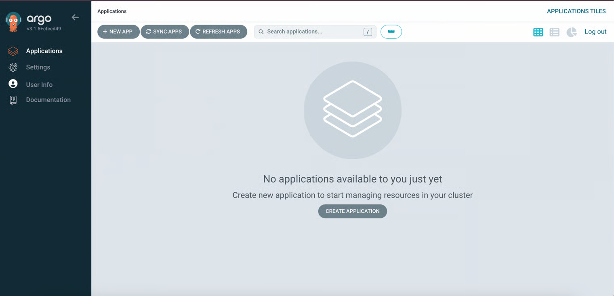

# Install Argo CD

1. Create File in Platform Folder

```
└── platform
    └── argocd
        ├── base
        │   ├── kustomization.yaml
        │   └── namespace.yaml
        └── overlays
            └── staging
                ├── argocd-ingress.yaml
                ├── kustomization.yaml
                ├── argocd-cmd-params-patch.yaml
```

see the content of those file in this committ [https://github.com/ridwands/INFRA-MANIFEST/tree/4d0b114fa60c681e4d40fc4ed8d146ccc9c01c34/platform/argocd](https://github.com/ridwands/INFRA-MANIFEST/tree/4d0b114fa60c681e4d40fc4ed8d146ccc9c01c34/platform/argocd)

2. Apply

```
kustomize build platform/argocd/overlays/staging | kubectl apply -f -
```

3. Make sure each pods are running

```
kubectl get po                                                                                                  
NAME                                                READY   STATUS    RESTARTS   AGE
argocd-application-controller-0                     1/1     Running   0          8m41s
argocd-applicationset-controller-8676b8756b-wmh24   1/1     Running   0          8m45s
argocd-dex-server-68b5d79cb9-n8wfm                  1/1     Running   0          8m45s
argocd-notifications-controller-bfc494cf8-bwnps     1/1     Running   0          8m45s
argocd-redis-656fdf7c5d-5md6j                       1/1     Running   0          8m44s
argocd-repo-server-6bcdd69bbb-t9dlj                 1/1     Running   0          8m42s
argocd-server-648fc5d9df-nbtdl  
```

4. Open Argo CD

open this ingress [http://staging-argocd.127.0.0.1.nip.io/](http://staging-argocd.127.0.0.1.nip.io/)

ensure, you're ran `minikube tunnel` before open the ingress

5. Get Initial Admin Password

username using `admin`

```
kubectl -n argocd get secret argocd-initial-admin-secret -o jsonpath="{.data.password}" | base64 --decode;echo
```

<figure><figcaption></figcaption></figure>
